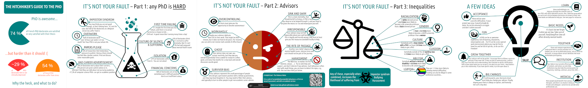
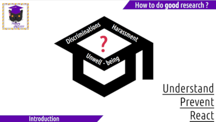

 

Welcome to the home of the **not in our labs** project, trying to fight back against harassment, discrimination and unwell-being in academia. 

The scientific consensus is that we need a global cultural change in academia to address those issues: such a thing can only come from us, the people in academia. This page offers several ressources on how we can do better.

# A Hitchiker’s guide to the PhD

The **Hitchiker’s guide to the PhD** is a small booklet meant to be given to anybody discovering research, during internships, PhDs, or even latter. It summarizes quickly a few key facts, and should make people more prepared for research, and notably learn to discern what is normal, and what is not.

::::: read-it

   
   <a class="btn-body" href="booklet/booklet-web.pdf"><i class="fa fa-file-o"></i> Read the booklet!</a>
    
   
   

::::::

* If you are a PhD student, read it!
* If you are an advisor, read it!
* And otherwise, read it!

This endeavour is essential, as 24% of international doctorates meet the symptoms to be classified as clinically depressed [@satinsky2021systematic], but less than a third (30,1%) of French PhD students consider to be well-informed on all those issues [@23], so, it is time to change this! 

For a ready to print and fold version, as well the detail of all the sources of the booklet, [see here](booklet.html). The booklet can also be used as A3 posters, it makes for a nice office decoration!

# A slideshow presentation, for researchers by researchers

::::: read-it

   
   

::::::

To make progress on those issues, we need to be frequently exposed to the subject. As part of the *not in our labs* project, a presentation has been designed, dubbed "Discriminations, Harassment and Unwell-being in Academia - Understand, React and Prevent", which is meant to be integrated **whithin** the usual scientific team/department/lab seminars. It is indeed a scientific talk, meant to be given by researchers and for researchers, and its content is essential to enable us to in fact do good research.

::::: read-it

 

::::::

If you are managing such a scientific seminar, you can contact me ([charlie.jacomme@inria.fr](mailto:charlie.jacomme@inria.fr)) and we can try to schedule such a talk (and if you are not managing such a seminar, you can still plant the seed and give my contact). It's abstract, slides, and highly detailed outline are [available here](presentation.html).

# Additional ressources

## Violence Meter

The violence meter is a prevention tool to spread awareness and help recognize unhealthy and dangerous behaviours in relationships. After an in-depth study, Giorgia Magni made a version dedicated to academia. The original ressoure and its description is in French [here](https://www.unige.ch/fapse/grire/outils-de-formation/violentometre).

Find the violence meter in english [here](ressources/violencemeter.pdf), and a more detailed description for each item [here](ressources/violencemeter_details.pdf).  For editable versions, see  [here](ressources/violencemeter.odg) and [here](ressources/violencemeter_details.odg).

## A library of ressources

All the ressources and references used either for the slideshow presentation or the hitchiker's guide booklet are listed [here](ressources.html), with small comments and main results extracted.

## Some home-made statics on gender gap in French Computer Science

Some statistics dedicated to the field of computer science were produced and [detailed here](computer_science.html), to be able to give a clear connection point for the booklet and the presentation. It is a side additional project, which also highlights some of the issues talked everywhere here.

## External ressources

Associations:

- [observatoire-vss.com](https://observatoire-vss.com/)
- [clasches.fr](https://clasches.fr/)
- [sos-homophobie.org](https://www.sos-homophobie.org/)

Ressources:

- [Le violentomètre du doctorat](https://sites.google.com/view/collectifecume/home/nos-productions/le-violentom%C3%A8tre-du-doctorat)
- [Guide de l'autodéfense universitaire](https://universiteouverte.org/autodefense-universitaire/)
- [Fiches d'infos techniques sur le doctorat](https://guide-doctorat.fr/fiches)

## Homepage logo

Logo is a modified public domain picture from Linnaea Mallette.
  
# References
