::: {#toc}
:::

For a variety of subjects, this page very quickly summarizes and cite some reports and publications.

# Gender and sexual harassment

###  Ireland  COSHARE North-South survey report [@coshare]

Survey on 521 staff members in Irish Higher Education:

 - "Almost two thirds of participants (64%) had
experienced sexual harassment in the past five
years. This included **57% who had experienced
sexist hostility, 23% with an experience of
electronic or visual sexual harassment, 34% who
experienced sexualised comments, 31% who had
experienced unwanted sexual attention, and 5%
with an experience of sexual coercion.**"
 - "A striking finding was that, for most participants who were
affected, harassment was experienced in both personal and professional
contexts" 
 - "(26%) experienced some form of sexual violence in the past five years, in their personal or professional lives" (half of those, 13%, at the workplace) 

On general well-being: "The PHQ-4 measure of anxiety and depression
demonstrated **widespread mental health burden among the participant
group as a whole**. Those with previous experience of SVH had
significantly higher scores than other survey respondent"

### National Surveys of Staff and Student Experiences of Sexual Violence and Harassment in Irish HEIs [@macneela2022report] [@macneela2022reportstaff]

11, 417 responses were received (7,901 students and 3,516 staff).

Staff:

- "**half of the respondents** described being **treated differently** (52%) or **being put
down or condescended to** (47%) because of gender. Approximately **one third** of the respondents
(35%) said they had **experienced sexist remarks**." 
- "sexual hostility or crude gender harassment was described by
between 14% and 21% of the survey respondents"
- "6% of survey respondents said someone had continued to ask them for a romantic date
even though they had said ‘no’ and 10% had the experience of someone making unwanted
attempts to establish a romantic sexual relationship with them"
- " coercive harassment ranged from 1% (retaliation after a
relationship ended), to 2% (implying better treatment) and 3% (feeling threatened, feeling
bribed with a reward)."
- " most common form of unwanted sexual contact was being touched in a
way that made them feel uncomfortable (12%)."
- "someone making unwanted attempts to stroke or kiss
the person. This was described by 4% of staff"

Students:

- **half experience gender harassment, a third sexual hostility**
- "Nearly three in ten of the students who responded to the survey said they felt like
they were being bribed with a reward or special treatment to engage in sexual behaviour, and
27% responded that someone had implied better treatment if they were sexually cooperative."
- "non-consensual sexual touching without any indication that the behaviour was welcome (45% of students overall)"
- "Nearly one in five **(19%)** of the females who responded to these statements **described
experiencing non-consensual vaginal penetration through coercion**, while 31% had this
experience while incapacitated, forced, or threatened with force."

### Sexual harassment of women: Climate, culture, and consequences in academic sciences, engineering, and medicine [@benya2018sexual]

A massive consensus study report from the US national academies of sciences, engineering and medecine.

"the **academic** workplace (i.e., employees of academic institutions)
has the **second highest rate of sexual harassment at 58 percent**
(the military has the high- est rate at 69 percent) when comparing it
with military, private sector, and the government"

"Greater than **50 percent of women faculty and staff and 20–50 per-
cent of women students encounter or experience sexually harassing
conduct in academia.**"

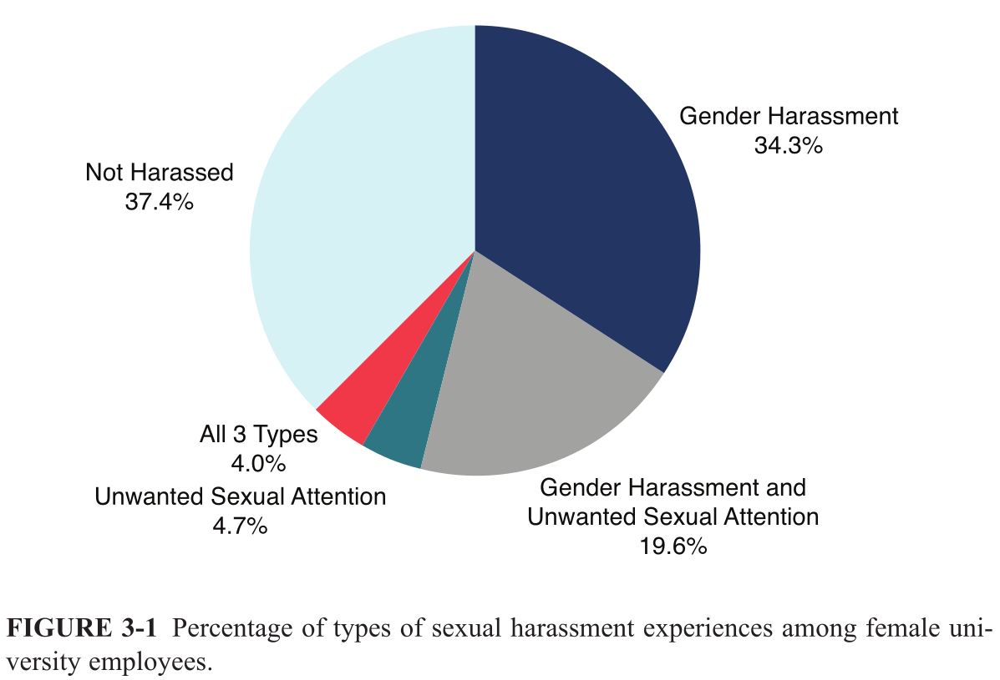

"the most potent predictor of sexual harassment is organizational
climate—the degree to which those in the organization perceive that
sexual harassment is or is not tolerated."

"The environments in which the **power structure** of an organization is
**hierarchical** with strong dependencies on those at higher levels or in
which people are geographically isolated are more likely to **foster and
sustain sexual harassment**." 

It is a full chain supporting the worst. 

"sexual coercion never took place without unwanted sexual attention and gender harass-
ment."

**Facts are too often ignored**: "The interview responses demonstrate
that the behavior of male colleagues, whom higher-ranking faculty or
administrators perceived as “superstars” in their par- ticular
substantive area, was often minimized or ignored."

**Big difference when asking**: "A meta-analysis of sexual harassment surveys demonstrates that the
prevalence rate is 24 percent when women are asked whether they have
**experienced “sexual harassment”** versus 58 percent when they are asked
whether they **experienced harassing behaviors that meet the definition**
of sexual harassment (and are then classifi d as such in the
analysis)"

"**Gender harassment has adverse effects**. Gender harassment that is severe
or occurs frequently over a period of time can result in the same level of
negative professional and psychological outcomes as isolated instances of
sexual coercion. Gender harassment, often considered a “lesser,” more in-
consequential form of sexual harassment, cannot be dismissed when present
in an organization. The greater the frequency, intensity, and duration of sexually harassing
behaviors, the more women report symptoms of **depression, stress, and
anxiety, and generally negative effects on psychological well-being**.
The more women are sexually harassed in an environment, the more
they think about leaving, and **end up leaving** as a result of the sexual
harassment."

**Following the law is not enough!** "Even though laws have been in place to protect women from sexual harass-
ment in academic settings for more than 30 years, the prevalence of sexual harass-
ment has changed little in that time."

"A **systemwide change to the culture and climate** in higher education is
required to prevent and effectively address all three forms of sexual ha-
rassment."

"Anti–sexual harassment training programs should focus on **changing
behavior, not on changing beliefs**. Programs should focus on clearly
communicating behavioral expectations, specifying consequences for
failing to meet these expectations, and identifying the mechanisms to be
utilized when these expectations are not met. Training programs should
not be based on the avoidance of legal liability."

**bystander training**: "Academic institutions should utilize training approaches that develop
skills among participants to interrupt and intervene when inappropriate
behavior occurs."

"**Reducing hierarchical power structures** and diffusing power more
broadly among faculty and trainees can reduce the risk of sexual ha-
rassment"

"Systems and policies that support targets of sexual harassment and
pro- vide options for **informal and formal reporting** can reduce the
reluctance to report harassment as well as reduce the harm sexual
harassment can cause the target."

"**Transparency and accountability** are crucial elements of effective sexual
harassment policies."

### Gender-based violence and its consequences in European Academia [@lipinsky2022gender]

Big survey of over 42 186 staff and students.
"Gender-based violence is understood as violence directed towards a person because of
their gender, or violence that affects persons of a specific gender disproportionately. The
forms of gender-based violence considered by the UniSAFE survey are based on the four
forms outlined in the Council of Europe’s Istanbul Convention (2011), that is, violence that
can be physical, sexual, psychological, or economic."

"**62%** of the survey respondents have experienced at least one form of **gender-based violence**"

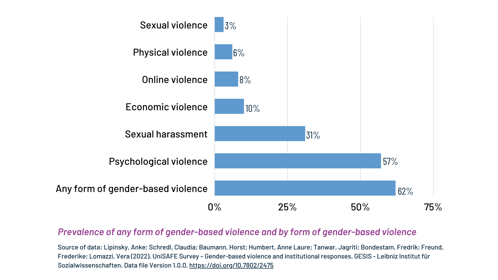

Many **groups are more likely to be targetted**:

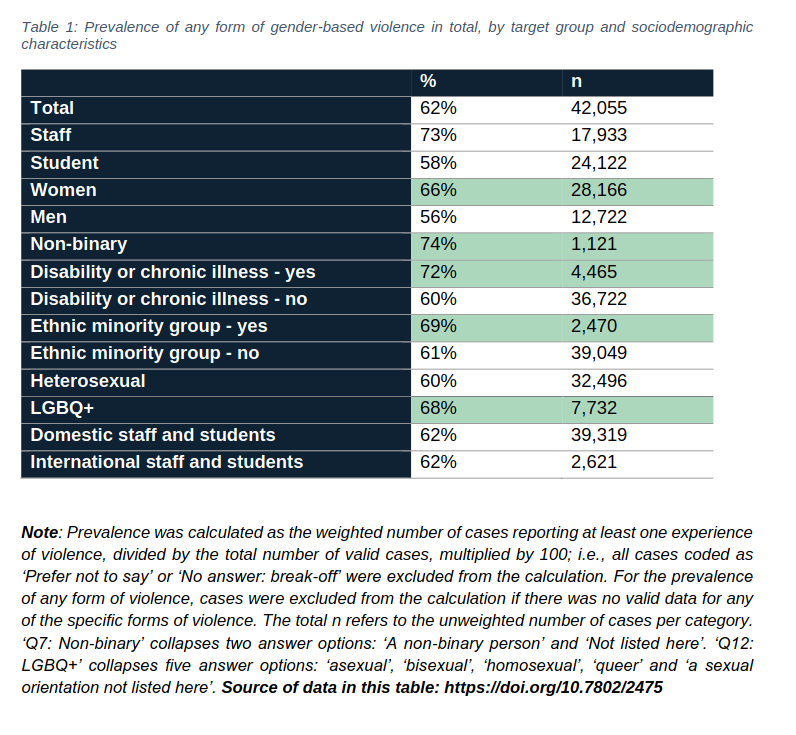

"**only 13% reported it**"

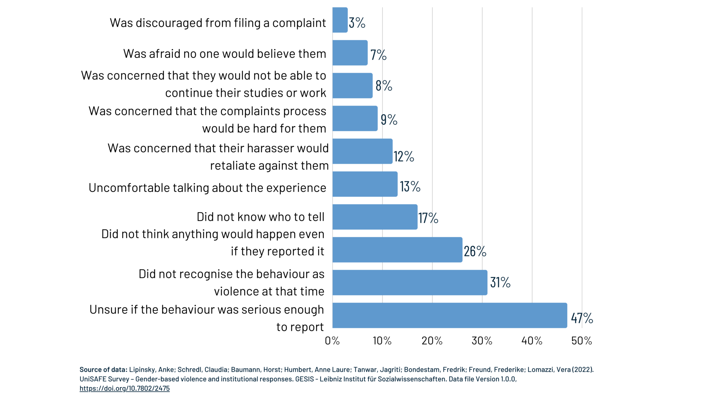

For staff, their are many **work-related consequences**

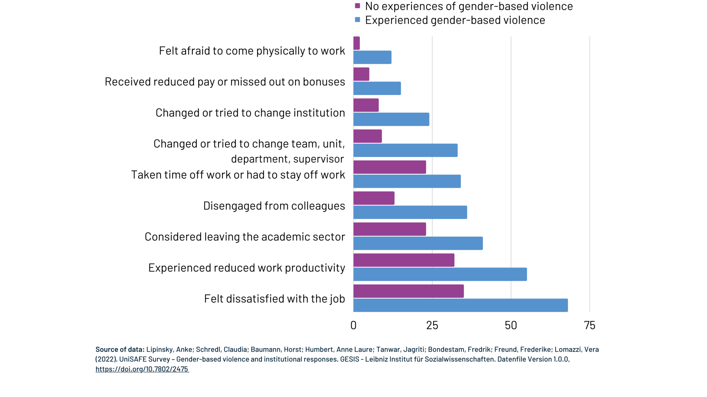

Or for students, **study-related consequences**
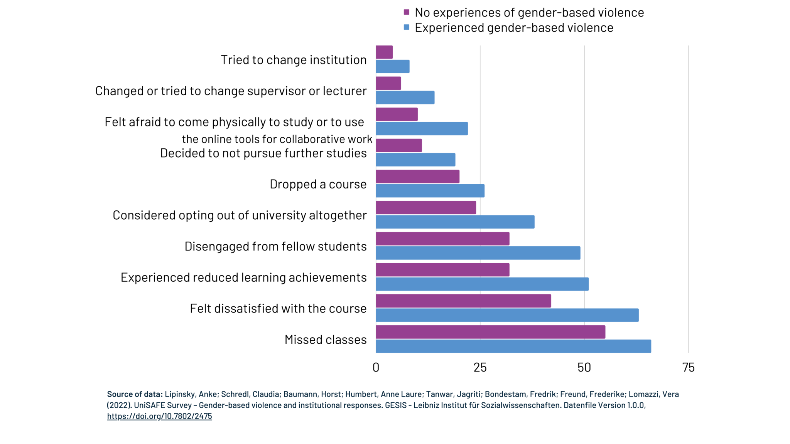

### Violences sexuelles dans l’enseignement supérieur en France : un focus sur l’alcool et le cannabis [@vss-alcool-mildeca]

Rapport sur une enquête nationale menéee en 2023-2024, 67 000 répondants:

 - "Depuis leur arrivée dans l’enseignement supérieur, **24 % des femmes, 9 % des hommes et 33 % des 
transgenre/non binaire/queer** ont subi au moins une forme d’**agression sexuelle ou de viol (ou tentative)**, souvent réitérée."5
 - "Selon les types de violences concernés (tentative d’agression sexuelle, agression sexuelle, tentative de viol ou viol), les étudiantes sont de 2.7 à 4.5 fois plus fréquemment victimes que les étudiants."
 - "23.8 % des étudiantes déclarent avoir subi une tentative d‘agression sexuelle, 18.7 % une agression sexuelle, 3.8 % une tentative de viol et 5 % un viol" (vs 1,1% de viol pour les hommes)
 - "Plus de la moitié des violences sexistes et sexuelles (VSS) en milieu étudiant implique une
consommation d'alcool."
- "Dans 90 à 95% des cas, quelles que soient les violences subies, les auteurs désignés sont de sexe masculin"
- En informatique, on est à 30% de taux de victimation pour les étudiantes.

*Keywords*: statistics, sexual assault, rape, alcool, france

### The Potential of Sexual Consent Interventions on College Campuses: A Literature Review on the Barriers to Establishing Affirmative Sexual Consent [@johnson2015potential]

There are rape myths: "In the case of sexual consent, **three rape myths**
are relevant to the new affirmative consent law: (a) **unintentional
sexual behavior occurs**, (b) **miscommunication about sexual behavior
happens**, and (c) **rape does not occur in a preexisting sexual
relationship**." 

They are myths:

 - "Ultimately, reported accidental or unintentional intercourse
results from coercive behavior and a lack of sexual consent. The
findings of this research undermine the rape myth suggesting that the
perpetrator did not mean to commit rape."
 - "This body of research about sexual communication demonstrates that
miscommunication cannot be blamed for sexual assault occurring "
 - " majority of women are sexually assaulted by an acquaintance"

Sexual scripts are created by medias and culture:

 - "A sexual script represents the
cognitive schema of the normative progression of events
in a sexual encounter"
 - "readers of men’s magazines reported lower intentions to ask for sexual consent, as
well as lower intentions to respect their partners’ sexual
consent decisions"

We need to focus on **broad cultural change**:
"Sexual communication, as discussed in this article, is shaped by
sociocultural issues such as sexual scripts, gender roles, and rape
myths (Murnen et al., 2002). Interventions that support broader
cultural change are needed (Jozkowski & Humphreys, 2014; Murnen et
al., 2002). If affirmative consent were to become the new social norm,
students may change to express more favorable attitudes towards
affirmative consent, change their sexual communication to actively
engage in affirmative consent, and reduce the prevalence of sexual
assault."

*Keywords*: sexual scripts, culture, rape myths

### Sciences : où sont les femmes ? [@acascience]

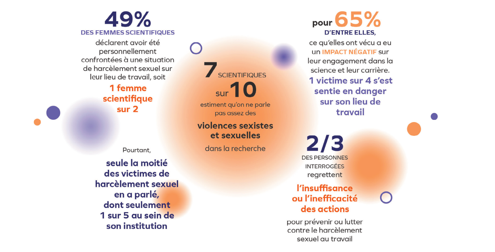

**Culture change**: "**L’idée impropre du bienfait de la compétition et
de l’instabilité des postes pour promouvoir la
production scientifique des jeunes est à proscrire
et cela bénéficiera aux femmes, comme aux
hommes.**"

**Bias**: "Sentiment de réussite aux évaluations selon le
genre : Indépendamment de leurs performances,
**le sentiment de réussite** aux évaluations est
toujours **inférieur pour les filles** que pour les
garçons, cet effet s’amplifiant entre la classe de
6e et la classe de seconde"

### Pressions, silence et résistances - Étude sur les violences sexistes et sexuelles et les discriminations en milieu doctoral en France [@obsvss]

Survey of 2100 French PhD students.

"Les femmes et les minorités de genre sont toujours surreprésentées parmi les
victimes : **27,5 % des femmes rapportent des violences sexistes** dans leur laboratoire,
contre 15,7 % des hommes. Les agressions sexuelles sont signalées par 7,1 % des femmes
en congrès et par 1,1 % dans le cadre du laboratoire. "

"les **auteurs** des violences sont **majoritairement des hommes** (83,3 %)"

"Plus de la moitié des répondant·es **(50,8 %) considèrent que les femmes voient
leur place constamment remise en cause**"

"la maternité représente un obstacle plus important au doctorat que la
paternité. Parmi les répondant·es, 80,4 % estiment qu’il est difficile
d’être mère lors de son doctorat, contre 49,2 % pour les pères."

"la majorité des répondant·es considère que les **mesures**
de prévention des VSS sont aujourd’hui encore **insuffisantes**"

"66,9 % des victimes d'agressions n’ont effectué aucun signalement et
environ 24 % des répondant·es ayant signalé ces violences rapportent un manque de
soutien ou des réactions inadéquates."

### Impact of the undressing consent program [@scott2024impact]

A US university, reports on training on consent, with a 90 minute dedicated training, with which students are very satisfied and yields change:

 - "Since 2021, Huron and King’s have invested in enhanced efforts to
prevent sexual violence on campus through the delivery of a 90-minute,
live-facilitated, interactive prevention program titled "Undressing
Consent.""
 -  "Almost **90% of the students were satisfied with Undressing Consent**.
They found it to be important and valuable."
 - "Most female and non-binary students reported high level of comfort in
having conversations about desires and boundaries despite
retrospectively reporting that Undressing Consent helped them better
communicate their boundaries. "
 - "The program was found to help navigate the transition to university
and led to some changes in student knowledge and attitudes about
consent. "

*Keywords*: consent, student training

### Effects of Mandatory Sexual Misconduct Training on University Campuses [@htun2022effects]

"Our surprising finding is that **training makes women less likely to
say that they would report sexual assault**. In all three studies,
participating in training is associated with a large and highly
statistically significant drop in the share of women who affirm that,
if they were sexually assaulted by another student, they would be
“very likely” or “somewhat likely” to report the experience to the
university.  Although our study was not designed to systematically
explore the reasons for the drop in reporting intentions, we speculate
about it on the basis of interview material and responses to other
survey questions. We suggest that training may aggravate women’s
perceptions of the social risks involved in reporting. Women students
resist labeling their experiences as assault and categorizing their
sexual relationships as nonconsensual or coercive in the ways
portrayed by training"

" The training produces some small positive effects: students gain
broader definitions of sexual misconduct and are less likely to
endorse common rape myths, and women students express less sexist
attitudes immediately after training."

*Keywords*: sexual assault, negative effect of training, fear of consequecnes

### Looking for a preventive approach to sexual harassment in academia. A systematic review [@zara2024looking]

"The findings confirm that academia is a breeding ground for SH
due to **power imbalances** and that vulnerabilities related to the macro-dynamics of power,
social and cultural inequalities are risk factors for SH. It is recommended that SH prevention
interventions in academia 1. adopt a **socio-ecological perspective**; 2. include evidence-based
programs such as those **dedicated to bystanders**; 3. are integrated with each other through
valuable networking and multistakeholder involvement and 4. pay attention to support com-
plaints, victim listening and intake activitie"

On bystander programs:
"Like several previously presented training and projects, bystander programs can be
transversal and situated between the individual, interpersonal, and contextual levels (Ban-
yard, 2011); these programs focus on recognizing early signs of sexually harmful behav-
ior and developing skills to intervene. Within this framework, bystander programs play an
important role in raising community awareness and creating “guardians” who can prevent
certain forms of SH and/or offer support to victims. The research conducted confirms that
after participating in bystander intervention training, faculty staff also felt that they could
play a crucial role in preventing violence by modeling prosocial behavior, seeking to be
perceived as allies by students, and challenging cultural norms related to SV (Robinson
et al., 2020)"

Interventions must adopt a socio-ecological perspective:
"On a more conceptual level, some research emphasizes the need to always con-
sider gender-based violence as a problem related to social inequalities and to highlight
the close connection between multiple structural forms of oppression when designing
interventions (Atkinson & Standing, 2019; Banner et al., 2022; Hurtado, 2021). "

*Keywords*: sexual harassment, bystander training, power

### Association Between Sexual Harassment Intervention Strategies and the Sexual Harassment Perception and Attitude of University Students in Beijing, China [@he2024association]

A bad perception of universities willingwness to act may undermines training effect:
"Education, training, and publicity programs are key to addressing the issue
of sexual harassment on campuses (Cleary et al.,1994; de Lijster et al., 2016;
Erinosho et al., 2021). Positive associations between informal education activ-
ities, multiformat publicity, and female students’ intolerant attitudes toward
sexual harassment were also observed in this study. However, prevention
mechanisms were negatively associated with intolerant attitudes toward sex-
ual harassment. Informal education activities and multiformat publicity appear
to be positive strategies. There may be some problems with the design, opera-
tion, or other aspects of sexual harassment prevention mechanisms that con-
tribute to the negative impact on students’ attitudes toward sexual harassment.
This would appear to be partly explicable in terms of futility in university
prevention mechanisms. To protect their reputations, **some universities remain
silent, refuse to inform the public about the process and outcomes, and punish
harassers too lightly** (Lay, 2019; Lichty et al., 2008; Robertson et al., 1988)."

*Keywords*: opaque report processes, training

### Can I Say “No”? How Power Dynamics Hinder Consent in University Settings [@bergeron2025can]

" Restricting the notion of sexual consent to its communicative
dimension risks perpetuating rape myths and victim-blaming, placing undue blame on
victims who have “failed to properly communicate.” Additionally, the influence of
**unequal power dynamics and gendered and social norms need to be addressed when dis-
cussing consent and sexual violence**. Consent education, including affirmative consent
and grey area trainings, remains important (Setty, 2023) and should incorporate chal-
lenges to social norms (e.g., heteronormative standards, gender-based power imbalances
such as expectations of male assertiveness and female compliance) and support the iden-
tification of conditions that render consent invalid (e.g., intoxication, coercion, position
of authority). The normalization of misconduct in supposedly safe environments and the
issue of institutional betrayal highlight the need for institutional change and courage.
**Universities must promote cultural change, challenge social norms, and ensure transpar-
ency and accountability to rebuild trust**"

# Discriminations

### Understanding Research Culture: What researchers think about the culture they work in [@moran2020]

For UK researchers, 94 qualitative interviews and a quantitative e-survey with 4267 usable responses.

### QUELLES POLITIQUES POUR RÉPONDRE AUX DISCRIMINATIONS À L’UNIVERSITÉ ? [@dhume2024quelles]

Based on ACADISCRI study, 4 FR universities,  over 10k answers.

"**14 % des étudiant·es et 11 % des
salarié.es des universités** enquêtées déclarent avoir subi des faits de **racisme**, dont
plus de la moitié sont estimés graves. Plus encore, les personnes racisées ― c’est-à-
dire traitées comme membres d’un groupe racial minoritaire ― sont plus de 33 %
à déclarer avoir vécu au cours de leurs études ou de leur carrière des traitements
inégalitaires racistes."

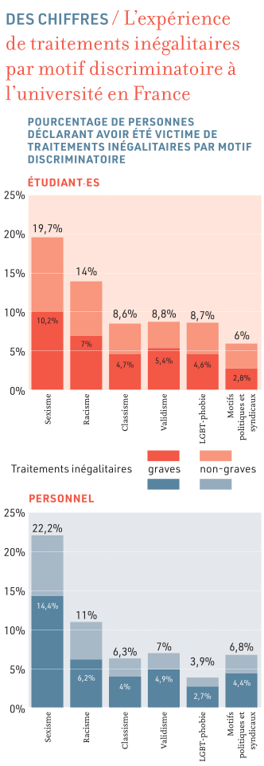

"L’enquête ACADISCRI montre que les **traitements discriminatoires
validistes affectent 8,8 % des étudiant·es et 7 % du personnel des
universités** enquêtées dans leur ensemble."

**Power structures**: "L’enquête ACADISCRI montre ainsi que, parmi les
groupes racisés, **les doctorant·es déclarent presque deux fois plus
de discrimination que les étudiant·es**, et approximativement entre
**trois et quatre fois plus que les diverses catégories de
personnels**."

"À l’opposé, une politique antidiscriminatoire devrait être une politique délibérément
“inclusive et démocratique” prenant à bras le corps **le problème des inégalités,
des rapports de pouvoir et des hiérarchisations sociales** – toutes choses qui struc-
turent en profondeur l’enseignement supérieur et la recherche. Ce devrait être une
politique qui **met en question les dynamiques de concurrence et de classement
qui structurent l’espace académique** (dont la psychologie sociale montre qu’elle
renforce les discriminations), qui s’attaque à transformer les normes qui régissent
le fonctionnement habituellement inégalitaire des institutions, et qui reconnaît
pleinement l’expertise des groupes minoritaires quant à la manière dont opèrent
concrètement les rapports de domination dans l’enseignement supérieur."

## Gender discrimination in academia

### The gender citation gap: Approaches, explanations, and implications [@wu2024gender]

**Women publish less, but are cited as much per paper**:
" I show that articles written
by women receive comparable or even higher rates of cita-
tions than articles written by men. However, women tend
to accumulate fewer citations over time and at the career
level. Contrary to the notion that women are cited less per
article due to gender-based bias in research evaluation or
citing behaviors, this study suggests that the primary reason
for the lower citation rates at the author level is women
publishing fewer articles over their careers."

### When Two Bodies Are (Not) a Problem: Gender and Relationship Status Discrimination in Academic Hiring [@rivera2017two]

"Drawing from gendered scripts of career and family that present men’s
careers as taking precedence over women’s, committee members assumed that heterosexual
women whose partners held academic or high-status jobs were not “movable,” and excluded
such women from offers when there were viable male or single female alternatives.
Conversely, committees infrequently discussed male applicants’ relationship status and
saw all female partners as movable. Consequently, I show that the **“two-body problem” is a
gendered phenomenon embedded in cultural stereotypes and organizational practices that
can disadvantage women in academic hiring.**"

### SHE Figures 2024 [@shefigures]

The leaky pipeline is everywhere:

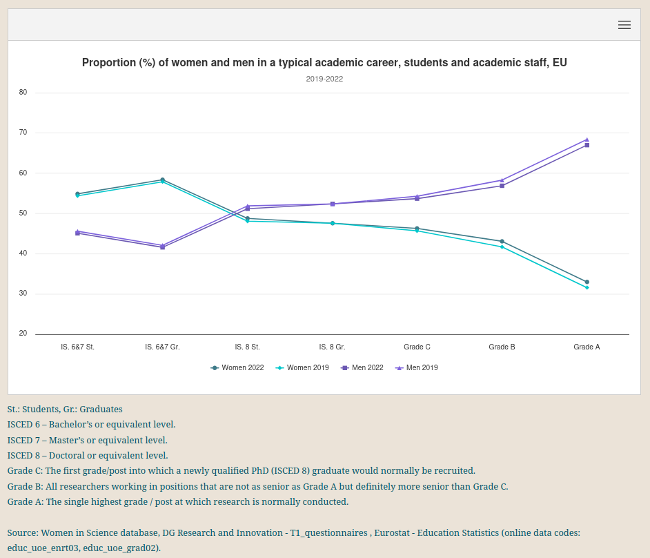

In STEM, we start from a worth position:
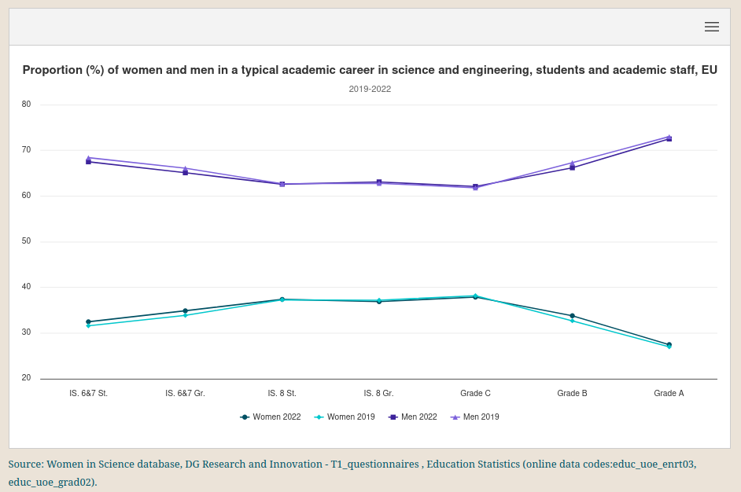

### Impact de la réforme du lycée sur l’enseignement de l’informatique : bilan et perspectives [@sif-reforme]

Very bad impact of a french 2019 highschool reform on share of women in computer science teaching.

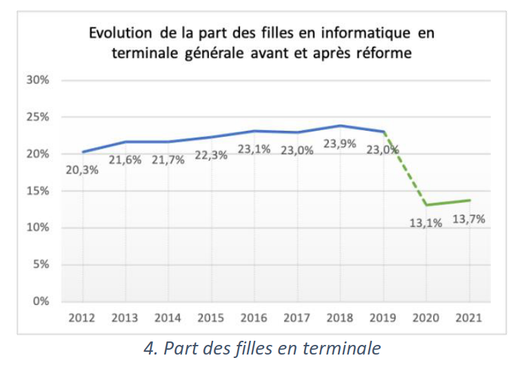

### Gendered Citations at Top Economic Journals [@koffi2021gendered]
 	
"This paper investigates how women's works are perceived among their peers. I construct a dataset using bibliographic data from articles published in top journals in economics and granular information on the articles that cite them. I find that **female-authored papers in top economic journals** are (i) more likely to be cited outside economics, (ii) **less likely to be cited by top-tier journals**, and (iii) **less likely to be cited by men**. I conclude with a discussion on those results and their implications for females in economics."

### Recognition for Group Work: Gender Differences in Academia [@sarsons2017recognition]
	
**Women don't get any credit for group work, while men do**:	
"How is credit for group work allocated when individual contributions are not observed? I use data on academics' publication records to test whether demographic traits like gender influence how credit is allocated under such uncertainty. While solo-authored papers send a clear signal about ability, coauthored papers are noisy, providing no specific information about each contributor's skills. I find that men are tenured at roughly the same rate regardless of coauthoring choices. Women, however, are less likely to receive tenure the more they coauthor. The result is much less pronounced among women who coauthor with other women."

### Men set their own cites high: Gender and self-citation across fields and over time [@king2017men]

"In the last two decades of data, **men self-cited 70 percent more than women**."

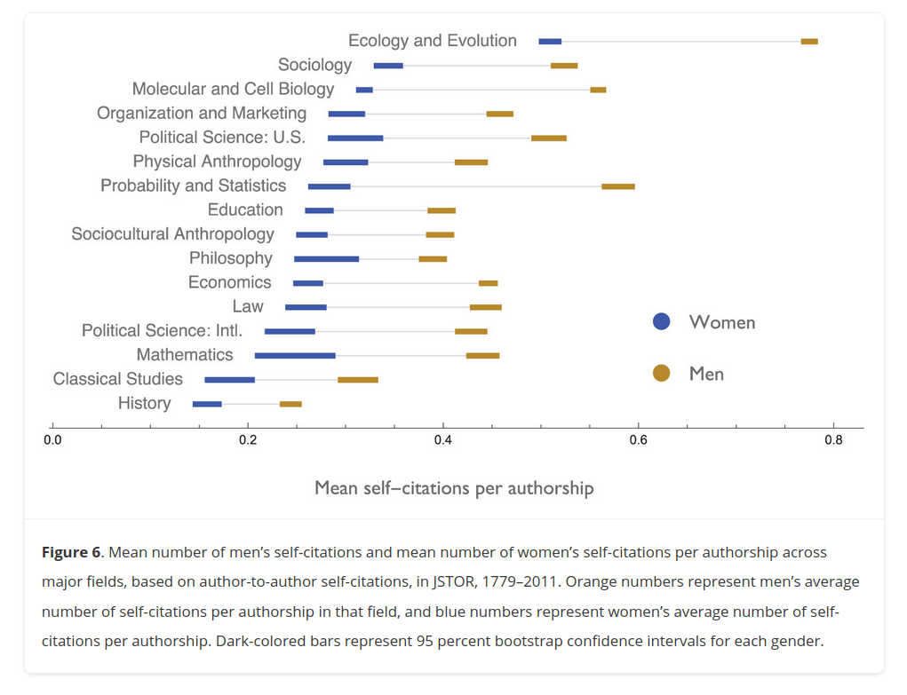

## Underrepresented minority (URM) discrimination

### Underrepresented minority faculty in the USA face a double standard in promotion and tenure decisions [@masters2024underrepresented]

"Data from five US universities on 1,571 faculty members’ P&T decisions show that **URM faculty received 7% more negative votes and were 44% less likely to receive unanimous votes from P&T committees**. A double standard in how scholarly productivity is rewarded is also observed, with below-average h-indexes being **judged more harshly for URM faculty than for non-URM faculty**."

## Weight discrimination

### Weight bias in graduate school admissions [@burmeister2013weight]

"**Higher BMI significantly predicted fewer post-interview offers** of admission into psychology graduate programs. Results also suggest this relationship is **stronger for female applicants**. BMI was not related to overall quality or the number of stereotypically weight-related adjectives in letters of recommendation. Surprisingly, higher BMI was related to more positive adjectives in letters."

### Weight bias among students and employees in university settings: an exploratory study [@sohier2025weight]

Study out of 292 students and 129 university employees:
"Approximately half of the respondents reported **experiencing
weight-related stigma (44.7%)**, and **half indicated holding prejudice
towards overweight people (51.1%)**, with a moderate rate of bias
according to the FPS (3.25). "

### « L'unif ne veut pas de moi ! » La grossophobie en milieu académique au prisme du genre [@claro2025unif]

A lack of statistics in France:

 - "En France, 17% de la population est classée « obèse » et 27-37% « en surpoids », selon l’indice
de masse corporelle (IMC) (Carof 2021a, pp 59-60)."
 - "Fondée sur des seuils d’IMC contestés, cette **pathologisation privilégie la responsabilisation individuelle au détriment d’une lecture structurelle des inégalités sociales de santé** (Carof 2019 ; 2021a, p 29)."
 - "Ces discriminations se traduisent vraisemblablement par une
sous-représentation des personnes grosses dans les carrières
scientifiques, bien qu’il n’y ait pas de statistiques disponibles à ce
sujet en Belgique ou en France."

## Statistics computations

To give a general idea, we compare the very simplified chances to become a professor/faculty/uni staff, based on some other characteristic (this is a simplified illustration, where all other things are considered equal and some numbers are approximated, some details on how we compute each chance is given afterward):

 - **men** are **2.6 times** more likely to become PU : 28% of UK university prof are women [@3], so `AdvMonF = 0,72/0,28 x 1 = 2.57`.
 - **somebody without a declared disability** is **4.6 times** more likely to become a uni staff:  4% of UK uni staff have a declared disability, vs 16% of pop [@7], so `AdvNotDisonDis = 0.96/.04 x  .16/0.84`.
 - a **white person** is **6.2 times** more likely to become a UK professor than a **black person**:  in UK, we have 18 770 White professor, 155 Black professor, 1495 Asian professor, 295 Mixed, 340 Other, and 1755 others [@3], so 0,7% of Black and 89% white for professor with known ethnicity, while 81.7% of the pop is white, and 4% is black, so   (`AdvWonB= 0.89/0.007 x 0.04/0.817 `)
 - somebody with **a close relative with a PhD** is **at least 2.4 times** more likely to get a PhD: 20% of french doctorates have a close relative with a phd [@0], while only 1,15% of the population has a thesis, and in France we have on average 1 brother, 2 parents, and then maybe 2 uncle/aunts and 4 grand parents, so we have by counting large at most 9 close relative in a family in france, so the chance to not have a close relative with a thesis is at most `0,9885^9=0,90` and we can say that less than 10% of the population has a close relative with a thesis (`AdvPhDRelativeonNot= 0.20/0.8 x 0.95/0.10=4.75`).
 
Given  two groups A and B (e.g. male and female), the chance of a member of group A to do X (e.g. become a prof) is `CA=(# of X in A)/(# of A)`, and similarly for B with `CB`. The advantage `AdvAonB` of A over B, how many times A has more chances to become X than B, is then `CA/CB`. By putting together the equations, we get `AdvAonB= ((# of X in A)/(# of X in B)) x ((# of B)/(# of A))`. As the goal is to compute this from the respective share of A/B in X (`%A-X` and `%B-X` or total population (`%A` and `%B`),  we simply multiply by the total populations as needed, and  `AdvAonB= ((# of X in A)/(# X) x (#X)/(# of X in B)) x (# of B)/(# population) x (# population)/(# of A))` and finally, `AdvAonB= (%A-X/%B-X) x  (%B/%A)`.

# Toxic culture in general

### Systematic review and meta-analysis of depression, anxiety, and suicidal ideation among Ph. D. students [@satinsky2021systematic]

"Among 16 studies reporting the prevalence of clinically significant symptoms of depression across 23,469 Ph.D. students, the pooled estimate of the proportion of **students with depression was 24%**"

### PhDs: the tortuous truth [@woolston2019phds]

6000 phd student survey by nature.

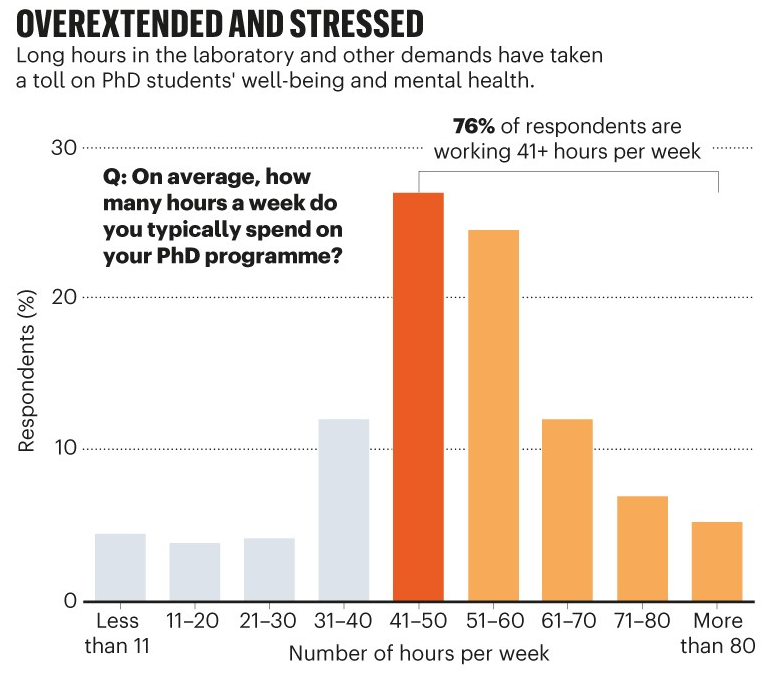

### La gestion du stress chez les doctorants : la surconsommation de certains produits qui pourraient nuire à leur santé [@gerard2013gestion]

Survey on 438 PhD students:

 - "Les résultats indiquent des corrélations significatives entre le
niveau de stress perçu, le sentiment d'avoir développé une addiction
depuis l’entrée en doctorat et l'année d'inscription en doctorat"
- "Les doctorantEs un niveau moyen de stress perçu plus élevé que
chez les doctorant"
- "Les **doctorants interrogés, disent avoir augmenté** leur consommation de café, de sucreries
(bonbons/chocolat), de vitamines, d’alcool et de tabac depuis leur entrée en doctorat dans une
proportion qui varie de 51,05 % pour le café à **17,48 % pour le tabac**.
L’augmentation de la consommation des autres produits (boissons stimulantes,
antidépresseurs, somnifères et drogues) est plus faible et n’atteint pas 10 %" (pour les antidépresseurs, 3,5% en consommé avant, et 7,51% en consomme maintenant)

# Looking forward

## Value of diversity

### Diversity leads to better science?  Gender-Heterogeneous Working Groups Produce Higher Quality Science [@campbell2013gender]

At a ecology and environmental sciences institute, **publications by mixed-gender teams are more cited**:
"While women continue to be underrepresented as working group participants, peer-reviewed publications with gender-heterogeneous authorship teams received 34% more citations than publications produced by gender-uniform authorship teams" 

*Keywords*: diversity, publication citations, better science

### Gender-diverse teams produce more novel and higher-impact [@yang2022gender]

In medical sciences, **science by mixed-gender teams is better** (though underrepresetend, significantly more novel and impactfull):

"We study mixed-gender research teams, examining 6.6 million papers
published across the medical sciences since 2000 and establishing
several core findings. First, the fraction of publications by
mixed-gender teams has grown rapidly, yet mixed-gender teams continue
to be underrepresented compared to the expectations of a null
model. Second, despite their underrepresentation, **the publications
of mixed- gender teams are substantially more novel and impactful than
t/he publications of same- gender teams of equivalent size**."

### Collaborating with people like me: Ethnic coauthorship within the United States [@freeman2015collaborating]

Study over "2.5 million scientific papers written by US-based
authors from 1985 to 2008".

"**diversity** in inputs by author ethnicity, location, and references
**leads to greater contributions to science** as measured by impact factors and citations."

## Improve Hiring

### Minimizing the Influence of Gender Bias on the Faculty Search Process [@fine2014minimizing]

**Workshops on diversity/bias training are somewhat efficient** (study at University of Wisconsin-Madison):
 "In departments where women are underrepresented, workshop participation is associated with a significant increase in the odds of making a job offer to a woman candidate, and with a non-significant increase in the odds of hiring a woman."

### Searching for a Diverse Faculty: What Really Works. [@goulden2019searching]

Use data from UC Berkley hirings to study efficiency of approachs
w.r.t. diversity hiring: "the 220 searches for which we received
survey data represented 94 per- cent of the 29,832 applicants for
Berkeley positions from academic years 2012–13 through 2015–1"

Most **promising approaches**:

- **shaping job description** "Of all the practices we studied, linking
job descriptions to issues of gender, race, or ethnicity had the most
impressive positive association with greater diversity.", "It is not
always easy for departments to think outside of traditional
disciplinary structures, but our data strongly suggest that this is an
effort well worth making when departments want to be sure they are
attracting the broadest pools of strong applicants."
- **setting departemental priorities** " some departments also explicitly
prioritized hiring faculty who will be able to make strong
contributions to the departmental goals for advancing diversity,
equity, and inclusion. "
- **mixed committees composition** (but put in place teaching hour
diminution for women!), "Compared with search committees that did not
have at least 40 percent women, those that did were more likely to
have higher percentages of both women and URMs under consideration at
each search stage" <!> not true in general, see two other papers on the subject here
- **targetted outreach** "Our research also confirmed the promise of
several kinds of targeted outreach that encourage applications from a
small number of unusually strong candidates who also would advance the
department’s diversity and equity goals"

Some approaches without support: "Our data **did not provide support for** using three search practices
that often are recommended or mandated: **reviewing comparative data,
taking steps to counter implicit bias, and requiring applicants to
provide evidence of their commitment to diversity**."

### Does the Gender Composition of Scientific Committees Matter? [@bagues2017does]
	
"We analyze how a larger presence of female evaluators affects committee decision-making using information on 100,000 applications to associate and full professorships in Italy and Spain. These applications were assessed by 8,000 randomly selected evaluators. A larger **number of women in evaluation committees does not increase either the quantity or the quality of female candidates who qualify**. Information from individual voting reports suggests that female evaluators are not significantly more favorable toward female candidates. At the same time, **male evaluators become less favorable toward female candidates as soon as a female evaluator joins the committee**. "

### Gender Quotas in Hiring Committees: A Boon or a Bane for Women? [@deschamps2024gender]

Since French law of 2015,  40% gender quotas in hiring committees.  

"Contrary to the objectives of the law, I show that **the reform backfired and significantly lowered women’s probability of being hired**. Because **the negative effect of the reform is concentrated in committees headed by men, this result seems driven by the reaction of men to the reform**.  I find little evidence that the reform affects supply-side characteristics, such as the likelihood of women applying. The results suggest that the underrepresentation of women is unlikely to be solved by simply increasing the share of women in hiring committees or interview panels."

### The achievement of gender parity in a large astrophysics research centre [@kewley2023achievement]

Between 2017 and 2022, the Astro3d center reached parity, from 38% to 50%.

Recruitement measures: 

- clear goals in terms of diversity 
- diversifiction of team leaders 
- 2 day trainging on diversity for everybody, every year. 
- minimal quota of 50% of women in postdoc hiring committees
- minimal quota of 50% of women on final postdoc listings

There is a cascading effect (+ leader women -> + postdoc women -> + PhD women), 

It is important to recruit AND keep people, **women  stay more in women lead teams".es femmes

Inclusivity Mesures:

- "implicit bias training, members also took cultural, LGBTQIA+, and Indigenous awareness training in subsequent annual retreats, and held monthly seminars on diversity and inclusion"
-  "The center’s code of conduct clearly established actions against sexism, insults, microaggressions, and behaviors that excluded other members, and the center had multiple ways of filing misconduct complaints."

### Increasing diversity in STEM academia: a scoping review of intervention evaluations [@meyer2025increasing]

**Lack of none US based data**:
" First, over 80% of the articles in this review were based in the
US. While this does not mean that interventions are not conducted
elsewhere, it does suggest that the current evidence base is
predominantly shaped by a particular national context. "

**Need to go beyond gender**:
"the low numbers of evaluated interventions targeting areas of
diversity beyond gender and racial/ethnic minorities is concerning as
it may signal low priorit"

**Most actions go for individual responsibility**:
"Moreover, our findings point to the popularity of support-based and
diversity training interventions with a disproportionate focus on
early career in comparison to, for example, policy changes or
interventions that address retention or equity beyond the initial
phases of the ‘pipeline’. As will be discussed further below, this
pattern appears to speak to an ‘individual responsibility’ approach
that prioritises changing the individual over changing the system
that disadvantages them"

"Third, the interventions we looked at overwhelmingly reflected ‘master’s tools’, that is **they were
implemented or endorsed by the institutional contexts that perpetuate the inequalities that are
addressed** (Morimoto and Zajicek 2014). This is perhaps unsurprising as we were focussing on
(largely) top-down intervention rather than grassroots action, but it does raise the question of the
extent to which sustainable change is possible. "

### Can mentoring help female assistant professors in economics? An evaluation by randomized trial [@ginther2020can]

CeMENT is a single-sex mentoring workshop to support women in research careers.
"The program was designed as a randomized controlled trial. This study evaluates differences
between the treatment and control groups in career outcomes. Results indicate that relative to
women in the control group, **treated women are more likely to stay in academia and more likely
to have received tenure in an institution ranked in the top 30 or 50 in economics in the world**"

Details on the workshop: "The CSWEP CeMENT workshop provides mentoring for women and nonbinary faculty in tenure-track positions at economics departments and similar institutions across North America. 
Participants are grouped with mentors based on research interests to discuss research projects and career goals. The program also features sessions on publishing, teaching, tenure preparation, grant writing, networking, and work/life balance."

### Reducing discrimination against job seekers with and without employment gaps [@kristal2023reducing]

"Past research shows that decision-makers **discriminate against applicants with career breaks**. Career breaks are common due to caring responsibilities, especially for working mothers, thereby leaving job seekers with employment gaps on their résumés."

"**Rewriting a résumé so that previously held jobs are listed with the number of years worked** (instead of employment dates) increases callbacks from real employers compared to résumés without employment gaps by approximately 8%, and with employment gaps by 15%."

### Les inégalités de genre dans les carrières académiques : quels diagnostics pour quelles actions ? [@faniko2021inegalites]

"Par ailleurs, **une adhésion forte à l’idéal méritocratique** – c’est-à-dire à la croyance en
un système de promotion et de rétribution basé sur le seul mérite individuel – inter-
vient également comme une source potentielle de **résistance** à l’encontre des mesures
égalitaire"

Three different point of view:
 - "Un registre **individuel** : quand les institutions académiques
s’interrogent sur ce qui « fait défaut » aux femmes", lead to mentoring, networking
 - "Un registre **sociétal** : des institutions académiques confrontées « malgré elles »
aux effets des régimes de genre extra-académiques", help child care, part time dispositives
 - "Un registre **organisationnel** : les institutions académiques comme productrices
d’inégalités", fight gender harassment, inclusivity. fight against stereotypes, quotas

**Institutions care about image**: "Nous avons constaté que les responsables institutionnel·es sont surtout
préoccupé·es par l’impact potentiel des mesures de promotion de l’égalité sur l’image de l’institution"

# Stereotypes and bias (in and beyond academia)

### Women are underrepresented in fields where success is believed to require brilliance [@meyer2015women]

**"brillance"-focused field lead to less women in them.** "The field-specific ability beliefs (FAB)
hypothesis aims to provide such an account, proposing that women are likely to be
underrepresented in fields thought to require raw intellectual talent—a sort of talent
that women are stereotyped to possess less of than men"

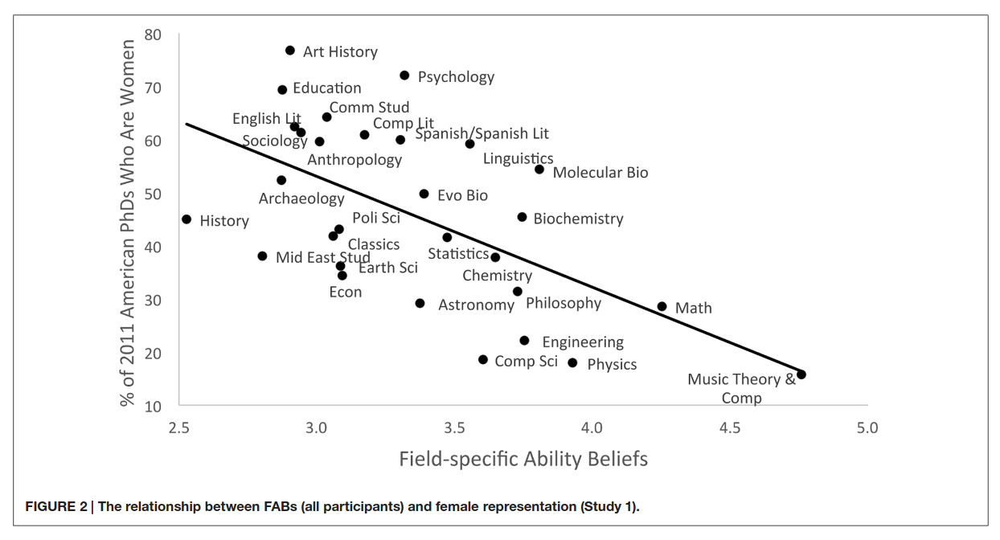

"If the practitioners of fields with gender gaps **made a concerted effort to highlight the role of sustained, long-term effort in achievement, the gender gaps in these fields may correspondingly be diminished.**"

### An Emphasis on Brilliance Fosters Masculinity-Contest Culture [@vial2022emphasis]

"Women are underrepresented in fields in which success is believed to require brilliance, but the reasons for this pattern are poorly understood. We investigated perceptions of a “masculinity-contest culture,” an organizational environment of ruthless competition, as a key mechanism whereby a perceived emphasis on brilliance discourages female participation. Across three preregistered correlational and experimental studies involving adult lay participants online (N = 870) and academics from more than 30 disciplines (N = 1,347), we found a **positive association between the perception that a field or an organization values brilliance and the perception that this field or organization is characterized by a masculinity-contest culture**. This association was particularly strong among women. In turn, **perceiving a masculinity-contest culture predicted lower interest and sense of belonging as well as stronger impostor feelings**. Experimentally reducing the perception of a masculinity-contest culture eliminated gender gaps in interest and belonging in a brilliance-oriented organization, suggesting possible avenues for intervention."

### The Development of Children’s Gender Stereotypes About STEM and Verbal Abilities: A Preregistered Meta-Analytic Review of 98 Studies [@miller2024development]

"This quantitative review of nearly 100 studies shows that, **by age 6, children already think that boys are better than girls at computer science and engineering**. With age, girls increasingly believe in male superiority in these technical fields—a stereotype that could potentially limit girls’ future aspirations. In contrast, children hold far more gender-neutral beliefs about math ability. Children also think that girls are much better in verbal domains like reading and writing, which could contribute to boys’ underachievement in those domains."

"Several recent studies have found “brilliance” stereotypes about exceptional intelligence favoring male targets among both child and adult participants in multiple cultures (Bian et al., 2017; Jaxon et al., 2019; Okanda et al., 2022; Shu et al., 2022; Storage et al., 2020; S. Zhao et al., 2022). "

(Bian et al, 2017 also shows that this impact the activities choosed by children )

"Young children are eager to find, remember, and construct positive information about their gender, driven by in-group gender bias as early as ages 3–5 (Dunham et al., 2016; Halim et al., 2017; Kurtz-Costes, Defreitas, et al., 2011). "

### How Preschoolers Associate Power with Gender in Male-Female Interactions: A Cross-Cultural Investigation [@charafeddine2020preschoolers]

	
In France, Lebannon and Norway, for 4-6 y-o children, **children assign the boy role to a dominant gender neutral character**. (not so much for 3 y-o)

### Looking Deathworthy: Perceived Stereotypicality of Black Defendants Predicts Capital-Sentencing Outcomes [@eberhardt2006looking]

The more somebody "looks like a black person" in front of a jury, the likelier they are to get death penalty.

# Just some brain breaking illusions

If some people need to be convinced that our brains lie to us, no matter how strong and rational we believe ourselves to be, this section should help. Of course, bias and stereotypes are more complex than the things below, yet, in many situation with incomplete information and where we are giving our best guess, how can we trust such powerful effects are not at play? (such examples can also be a fun way to engage the audience in a otherwise difficult presentation on the difficult topics discussed here)

### Change Blindness

Sometimes, we can't see something changing right in front of our eyes. Can you see what's changing between the two blinking pictures?

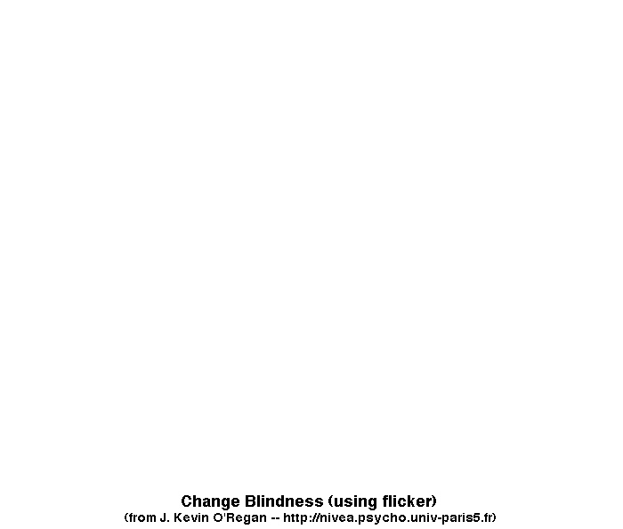

If you give up, you can [click here](biblio-pics/illusion-Sailboat-sol.png) for the solution

### Face recognition

Is their anything wrong with those two pictures of Einstein? By looking closely, you might see some small differences.

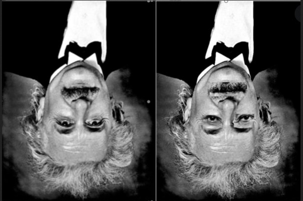

Now, flip your screen over and look again. Berk. (or [click here](biblio-pics/thatcher-effect-sol.jpg))

### Bistable optical illusions

A classic, where we either see the dancer going left or right.

Less known is the extended version, where two variants with depth inversion have been added, and looking only at the left or right dancer then changes the rotation direction of the middle one.

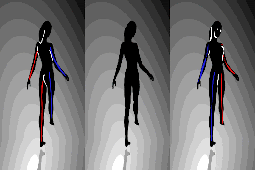

### Checker shadow illusion

You will see in the picture below square A and B with clearly distinct colors:

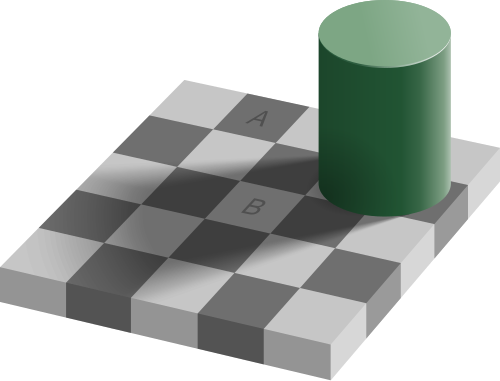

Yet, they are not!

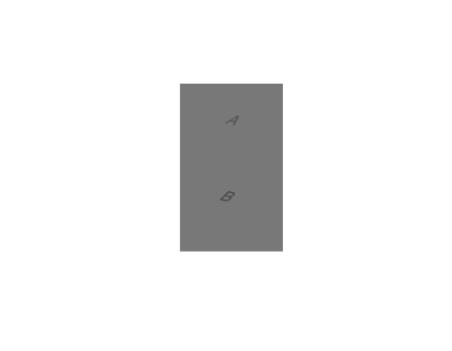

### Hidden object

Can you find the hidden object in this picture?

If you give up, [click here](biblio-pics/hidden-object-sol.png) to see the solution.
